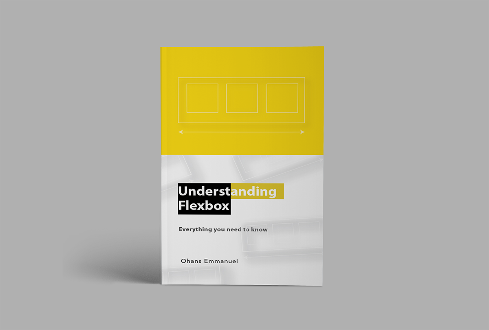
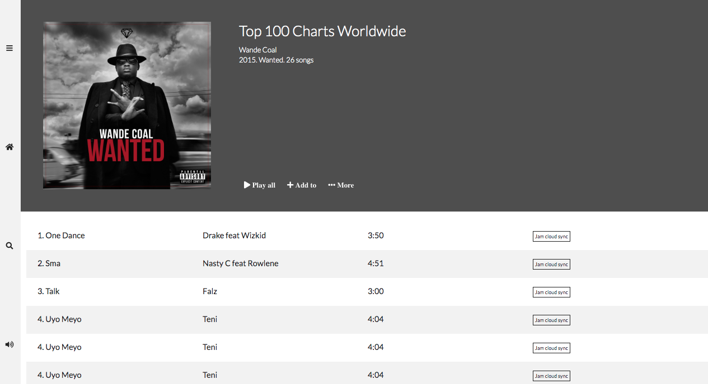

# Project Title

Building a music player using CSS FlexBox with the aim of mobile responsiveness.

# Motivation for this project.

My gratitude goes out to this book by [Ohans Emmanuel](https://medium.com/@ohansemmanuel), [Understanding Flexbox: Everything you need to know](https://www.freecodecamp.org/news/understanding-flexbox-everything-you-need-to-know-b4013d4dc9af/)

# Getting Started

You need to have basic understanding of HTML and CSS to take on this project and Understanding Flexbox would do just that to help you begin your journey on becoming a __Flexbox ninja__

* Fontawesome - for your icons used in the project

# Final project

# Deployment

[Surge](https://surge.sh/)

# Author

Teri Eyenike

Free pdf version of understanding flexbox, click [HERE](https://ohansemmanuel.github.io/uf_download.html)

[Jam Musik Player](http://necessary-plants.surge.sh/)